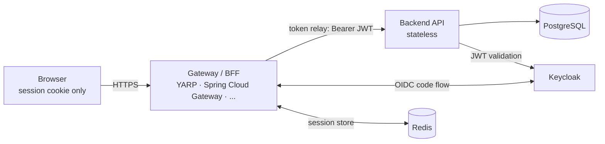

# Stackverse

**One app, every stack.**

Stackverse is a single, deliberately non-trivial product — a bookmark manager — implemented
multiple times across different languages, frameworks, and runtimes. Every implementation
conforms to the same contract, so you can put any frontend in front of any gateway in front
of any backend and the app still works.

The scope is small but exercises what real services need: OIDC auth, hierarchical
role-based authorization, ownership rules, validation, pagination and filtering,
runtime-managed internationalization (localized messages served and edited through
the API), HTTP caching with ETag revalidation, API versioning with a live v1 → v2
migration (offset → cursor pagination, RFC-compliant deprecation headers), and a
backoffice — moderation queue with a report state machine, app-level user blocking,
an append-only audit trail, and a stats dashboard.

## Why

- **Compare stacks on equal footing.** Same spec, same architecture, same author, same
  conventions — and the same design across all frontends (shared stylesheet, no UI
  frameworks), so differences you see are differences between the stacks, not between
  authors or themes.
- **A reference for mentees.** "How do I structure a Spring Boot service?" or "how does
  session auth work with a BFF?" — point at a complete, working, consistent example.
- **Production-shaped, not toy-shaped.** Stateless services, gateway-owned sessions, OIDC,
  containers, migrations, health checks. Small scope, real architecture.

Full intent, goals, and non-goals: [docs/INTENT.md](docs/INTENT.md)

### Why not RealWorld?

[RealWorld](https://github.com/gothinkster/realworld) is great, but its implementations are
community-contributed — wildly inconsistent in quality and mostly unmaintained — and its spec
mandates JWTs held by the SPA. Stackverse is single-author, consistent across stacks, and
built on the **BFF / token-handler pattern**: the browser only ever sees a session cookie,
tokens never leave the server side.

## Architecture

Stateless applications; the session lives at the edge.



- The **gateway** is the OIDC client. It handles login/logout, keeps the session
  (cookie ↔ Redis), and relays the access token to the backend on each proxied request.
- The **backend** is fully stateless: it validates the bearer JWT against the IdP and
  serves the API. Any instance can serve any request.
- The **frontend** is a SPA served through the gateway. It knows nothing about tokens —
  it calls `/api/*` with `credentials: include` and asks `/auth/session` who is logged in.

Details: [docs/ARCHITECTURE.md](docs/ARCHITECTURE.md)

## The contract

Every implementation must satisfy:

- [docs/SPEC.md](docs/SPEC.md) — functional spec of the app (features, rules, acceptance criteria)
- [spec/openapi.yaml](spec/openapi.yaml) — the API contract backends implement and frontends consume
- Component conventions: [backends/](backends/README.md) · [gateways/](gateways/README.md) · [frontends/](frontends/README.md)

## Implementation matrix

| Component | Stack | Directory | Status |
|---|---|---|---|
| Backend | Spring Boot (Kotlin) | `backends/spring-kotlin` | ✅ done |
| Backend | ASP.NET Core (C#) | `backends/dotnet` | planned |
| Backend | Go (stdlib + chi) | `backends/go` | planned |
| Backend | Node.js (TypeScript) | `backends/node-ts` | planned |
| Gateway | Spring Cloud Gateway | `gateways/spring-cloud-gateway` | planned |
| Gateway | YARP (ASP.NET Core) | `gateways/yarp` | ✅ done |
| Frontend | React | `frontends/react` | ✅ done |
| Frontend | Angular | `frontends/angular` | planned |

## Quickstart

All run modes (frontend-only dev, full stack, observability, logs) are covered
in [docs/RUNNING.md](docs/RUNNING.md); the short version:

Infrastructure only (PostgreSQL, Redis, Keycloak with a pre-imported realm):

```sh
docker compose up -d
```

Full stack (once implementations exist) — pick any combination via env vars:

```sh
BACKEND_IMAGE=stackverse/backend-spring-kotlin:local \
GATEWAY_IMAGE=stackverse/gateway-yarp:local \
docker compose --profile app up
```

or, building the images first: `BUILD=1 ./scripts/run-stack.sh`
(PowerShell: `./scripts/run-stack.ps1 -Build`).

Then open http://localhost:8000 and log in as `demo` / `demo` (regular user),
`moderator` / `moderator` (reports queue, dashboard), or `admin` / `admin`
(full backoffice).

| Service | URL |
|---|---|
| App (gateway) | http://localhost:8000 |
| Keycloak admin | http://localhost:8180 (`admin` / `admin`) |
| PostgreSQL | localhost:5432 (`stackverse` / `stackverse`) |

## Repository layout

```
spec/          the OpenAPI contract
docs/          functional spec, architecture
backends/      one directory per backend implementation
gateways/      one directory per gateway implementation
frontends/     one directory per frontend implementation
infra/         shared infrastructure config (Keycloak realm, ...)
compose.yaml   infra + pluggable app combination
```

## License

[MIT](LICENSE)
