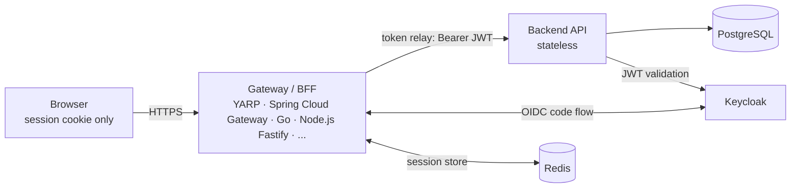

# Stackverse

[](https://github.com/kamkie/stackverse/actions/workflows/ci.yml)
[](https://github.com/kamkie/stackverse/actions/workflows/codeql.yml)
[](https://codecov.io/gh/kamkie/stackverse)

**One app, every stack.**

Stackverse is a single, deliberately non-trivial product — a bookmark manager — implemented
multiple times across different languages, frameworks, and runtimes. Every implementation
conforms to the same contract, so you can put any frontend in front of any gateway in front
of any backend and the app still works.

The scope is small but exercises what real services need: OIDC auth, hierarchical
role-based authorization, ownership rules, validation, pagination and filtering,
runtime-managed internationalization (localized messages served and edited through
the API), HTTP caching with ETag revalidation, API versioning with a live v1 → v2
migration (offset → cursor pagination, RFC-compliant deprecation headers), and a
backoffice — moderation queue with a report state machine, app-level user blocking,
an append-only audit trail, and a stats dashboard.

## Why

- **Compare stacks on equal footing.** Same spec, same architecture, same author, same
  conventions — and the same design across all frontends (shared stylesheet, no UI
  frameworks), so differences you see are differences between the stacks, not between
  authors or themes.
- **A reference for mentees.** "How do I structure a Spring Boot service?" or "how does
  session auth work with a BFF?" — point at a complete, working, consistent example.
- **Production-shaped, not toy-shaped.** Stateless services, gateway-owned sessions, OIDC,
  containers, migrations, health checks. Small scope, real architecture.

Full intent, goals, and non-goals: [docs/INTENT.md](docs/INTENT.md)

### Why not RealWorld?

[RealWorld](https://github.com/gothinkster/realworld) is great, but its implementations are
community-contributed — wildly inconsistent in quality and mostly unmaintained — and its spec
mandates JWTs held by the SPA. Stackverse is single-author, consistent across stacks, and
built on the **BFF / token-handler pattern**: the browser only ever sees a session cookie,
tokens never leave the server side.

## Architecture

Stateless applications; the session lives at the edge.



- The **gateway** is the OIDC client. It handles login/logout, keeps the session
  (cookie ↔ Redis), and relays the access token to the backend on each proxied request.
- The **backend** is fully stateless: it validates the bearer JWT against the IdP and
  serves the API. Any instance can serve any request.
- The **frontend** is a SPA served through the gateway. It knows nothing about tokens —
  it makes same-origin `/api/*` calls (the browser attaches the session cookie) and asks
  `/auth/session` who is logged in.

Details: [docs/ARCHITECTURE.md](docs/ARCHITECTURE.md)

## The contract

Every implementation must satisfy:

- [docs/SPEC.md](docs/SPEC.md) — functional spec of the app (features, rules, acceptance criteria)
- [spec/openapi.yaml](spec/openapi.yaml) — the API contract backends implement and frontends consume
- [docs/LOGGING.md](docs/LOGGING.md) — logging requirements (what to emit, what never to log)
- [docs/INVARIANTS.md](docs/INVARIANTS.md) — what must be identical in every stack vs. what is free to be idiomatic per stack
- [docs/CONVENTIONS.md](docs/CONVENTIONS.md) — common conventions per language/framework, and where each variant follows or deliberately departs
- Component conventions: [backends/](backends/README.md) · [gateways/](gateways/README.md) · [frontends/](frontends/README.md)

The contract is executable: the black-box suite in [conformance/](conformance)
runs any backend through the API rules above (`./scripts/conformance.sh`),
and the [e2e/](e2e) suite drives any composed stack through the UI. Those two
suites are the canonical acceptance gates. Additional testing-tool examples live
under [testing/](testing/README.md) as showcase variants: they compare tools and
representative workflows without replacing or expanding the canonical gates.
The Schemathesis showcase in [testing/schemathesis-api/](testing/schemathesis-api)
generates bounded OpenAPI property tests against a running backend, the
Robot Framework showcase in
[testing/robot-acceptance/](testing/robot-acceptance) demonstrates
keyword-driven UI acceptance tests against a running stack, the
Bruno showcase in [testing/bruno-api/](testing/bruno-api) provides a curated
API-client collection for direct-backend exploration, the k6 showcase in
[testing/k6-system/](testing/k6-system) runs system smoke and light-load checks
against a composed stack without making benchmark claims, the
axe-core showcase in [testing/axe-a11y/](testing/axe-a11y) runs automated
accessibility checks against representative browser states, the OWASP ZAP
showcase in [testing/zap-security/](testing/zap-security) runs a passive
baseline security smoke scan against a running gateway, and the Hurl showcase
in [testing/hurl-api/](testing/hurl-api) documents representative HTTP API
flows as executable plain text, and the Postman showcase in
[testing/postman-api/](testing/postman-api) provides a Newman/Postman CLI
collection for representative API workflows.
CI runs affected implementation builds and contract-suite legs on pull requests,
then keeps the full sweep on `main`, scheduled, and manual runs. Trusted
`main`-branch jobs also submit build-time dependency snapshots where CI can
provide a richer resolved graph than static manifest parsing (see
[docs/RUNNING.md](docs/RUNNING.md#continuous-integration)).

## Implementation matrix

| Component | Stack | Directory | Status | Coverage |
|---|---|---|---|---|
| Backend | Spring Boot (Kotlin) | `backends/spring-kotlin` | ✅ done | [](https://app.codecov.io/gh/kamkie/stackverse/flags) |
| Backend | Ktor (Kotlin) | `backends/ktor-kotlin` | ✅ done | [](https://app.codecov.io/gh/kamkie/stackverse/flags) |
| Backend | ASP.NET Core (C#) | `backends/dotnet` | ✅ done | [](https://app.codecov.io/gh/kamkie/stackverse/flags) |
| Backend | Go (stdlib + chi) | `backends/go` | ✅ done | [](https://app.codecov.io/gh/kamkie/stackverse/flags) |
| Backend | Go (Echo) | `backends/go-echo` | ✅ done | [](https://app.codecov.io/gh/kamkie/stackverse/flags) |
| Backend | Grails (Groovy) | `backends/grails` | ✅ done | [](https://app.codecov.io/gh/kamkie/stackverse/flags) |
| Backend | Micronaut (Java) | `backends/micronaut-java` | ✅ done | [](https://app.codecov.io/gh/kamkie/stackverse/flags) |
| Backend | Node.js (TypeScript) | `backends/node-ts` | ✅ done | [](https://app.codecov.io/gh/kamkie/stackverse/flags) |
| Backend | Node.js (NestJS) | `backends/node-nestjs` | ✅ done | [](https://app.codecov.io/gh/kamkie/stackverse/flags) |
| Backend | Open Liberty Java (Maven) | `backends/open-liberty-java` | ✅ done | [](https://app.codecov.io/gh/kamkie/stackverse/flags) |
| Backend | Python Django + DRF | `backends/python-django` | ✅ done | [](https://app.codecov.io/gh/kamkie/stackverse/flags) |
| Backend | Python FastAPI | `backends/python-fastapi` | ✅ done | [](https://app.codecov.io/gh/kamkie/stackverse/flags) |
| Backend | Play Framework (Scala) | `backends/play-scala` | ✅ done | [](https://app.codecov.io/gh/kamkie/stackverse/flags) |
| Backend | Quarkus Java (Maven) | `backends/quarkus-java` | ✅ done | [](https://app.codecov.io/gh/kamkie/stackverse/flags) |
| Backend | Rust Axum | `backends/rust-axum` | ✅ done | [](https://app.codecov.io/gh/kamkie/stackverse/flags) |
| Backend | Ruby on Rails API | `backends/ruby-rails` | ✅ done | [](https://app.codecov.io/gh/kamkie/stackverse/flags) |
| Gateway | Spring Cloud Gateway (Kotlin) | `gateways/spring-cloud-gateway` | ✅ done | [](https://app.codecov.io/gh/kamkie/stackverse/flags) |
| Gateway | Go (stdlib + chi) | `gateways/go` | ✅ done | [](https://app.codecov.io/gh/kamkie/stackverse/flags) |
| Gateway | Node.js Fastify | `gateways/node-fastify` | ✅ done | [](https://app.codecov.io/gh/kamkie/stackverse/flags) |
| Gateway | OpenResty (nginx + Lua) | `gateways/openresty` | ✅ done | [](https://app.codecov.io/gh/kamkie/stackverse/flags) |
| Gateway | Rust Axum | `gateways/rust` | ✅ done | [](https://app.codecov.io/gh/kamkie/stackverse/flags) |
| Gateway | YARP (ASP.NET Core) | `gateways/yarp` | ✅ done | [](https://app.codecov.io/gh/kamkie/stackverse/flags) |
| Frontend | React | `frontends/react` | ✅ done | [](https://app.codecov.io/gh/kamkie/stackverse/flags) |
| Frontend | Angular | `frontends/angular` | ✅ done | [](https://app.codecov.io/gh/kamkie/stackverse/flags) |
| Frontend | SolidJS | `frontends/solid` | ✅ done | [](https://app.codecov.io/gh/kamkie/stackverse/flags) |
| Frontend | Svelte | `frontends/svelte` | ✅ done | [](https://app.codecov.io/gh/kamkie/stackverse/flags) |
| Frontend | Vanilla TypeScript | `frontends/vanilla-ts` | ✅ done | [](https://app.codecov.io/gh/kamkie/stackverse/flags) |
| Frontend | Vue | `frontends/vue` | ✅ done | [](https://app.codecov.io/gh/kamkie/stackverse/flags) |

Line counts per variant — split into source / tests / config / docs, with a
language breakdown and Dockerfile size — live in
[docs/CODE-STATS.md](docs/CODE-STATS.md). Files come from `git ls-files`, counts
from [`tokei`](https://github.com/XAMPPRocky/tokei); the single generator is
[`tools/code-stats.mjs`](tools/code-stats.mjs). Regenerate with
`./scripts/code-stats.sh --write docs/CODE-STATS.md` (PowerShell:
`./scripts/code-stats.ps1 -Write docs/CODE-STATS.md`).

## Quickstart

All run modes (frontend-only dev, full stack, observability, logs) are covered
in [docs/RUNNING.md](docs/RUNNING.md); the short version:

Infrastructure only (PostgreSQL, Redis, Keycloak with a pre-imported realm):

```sh
docker compose up -d
```

Full stack — pick any combination via env vars:

```sh
BACKEND_IMAGE=stackverse/backend-spring-kotlin:local \
GATEWAY_IMAGE=stackverse/gateway-yarp:local \
FRONTEND_IMAGE=stackverse/frontend-react:local \
docker compose --profile app up
```

or, building the images first: `BUILD=1 ./scripts/run-stack.sh`
(PowerShell: `./scripts/run-stack.ps1 -Build`).

For development — infra in Docker, each module as a hot-reloading dev process
in its own terminal tab, logs tee'd to `.logs/` — use `./scripts/dev-stack.sh`
(PowerShell: `./scripts/dev-stack.ps1`). With any stack running, the
end-to-end suite drives the real app through every required screen:
`./scripts/e2e.sh` (PowerShell: `./scripts/e2e.ps1`). With just infra and a
backend, `./scripts/conformance.sh` (PowerShell: `./scripts/conformance.ps1`)
checks that backend against the API contract directly. For optional OpenAPI
property fuzzing against the same running backend, use
`./scripts/schemathesis-api.sh` (PowerShell:
`./scripts/schemathesis-api.ps1`). For a curated API-client walkthrough of the
same direct-backend surface, run the Bruno showcase from `testing/bruno-api`.
For optional k6 system smoke and light-load checks against a running composed
stack, use `./scripts/k6-system.sh` (PowerShell:
`./scripts/k6-system.ps1`). For a readable Hurl API showcase against the same
backend target, use `./scripts/hurl-api.sh` (PowerShell:
`./scripts/hurl-api.ps1`). For an optional passive security smoke scan against
a running gateway, use `./scripts/zap-security.sh` (PowerShell:
`./scripts/zap-security.ps1`). For optional trace-based observability
assertions against a composed stack with OpenTelemetry enabled, use
`./scripts/tracetest-otel.sh` (PowerShell:
`./scripts/tracetest-otel.ps1`). For an optional Postman/Newman API showcase,
run `yarn test` from `testing/postman-api` against the same direct backend
target.

To populate a small repeatable local dataset for demos, run the seed against
the running backend API:

```sh
./scripts/seed-test-data.sh
```

```powershell
./scripts/seed-test-data.ps1
```

The seed uses the dev Keycloak users and the public API, so it works with any
backend implementation. It is idempotent by seed title and leaves one open
report plus one hidden bookmark for the backoffice screens. Wipe local data
with `docker compose down -v` before recreating the stack.

Then open http://localhost:8000 and log in as `demo` / `demo` (regular user),
`moderator` / `moderator` (reports queue, dashboard), or `admin` / `admin`
(full backoffice).

| Service | URL |
|---|---|
| App (gateway) | http://localhost:8000 |
| Keycloak admin | http://localhost:8180 (`admin` / `admin`) |
| PostgreSQL | localhost:5432 (`stackverse` / `stackverse`) |

## Repository layout

```
spec/          the OpenAPI contract
docs/          functional spec, architecture
backends/      one directory per backend implementation
gateways/      one directory per gateway implementation
frontends/     one directory per frontend implementation
conformance/   black-box API contract suite, run directly against any backend
e2e/           black-box Playwright suite for any composed stack
testing/       optional testing-tool showcase suites and their conventions
infra/         shared infrastructure config (Keycloak realm, ...)
scripts/       build/run/test helpers, each as a .ps1 + .sh pair
tools/         implementation-neutral developer helpers used by scripts
compose.yaml   infra + pluggable app combination
.github/       CI + CodeQL workflows, Dependabot config
```

## License

[MIT](LICENSE)
