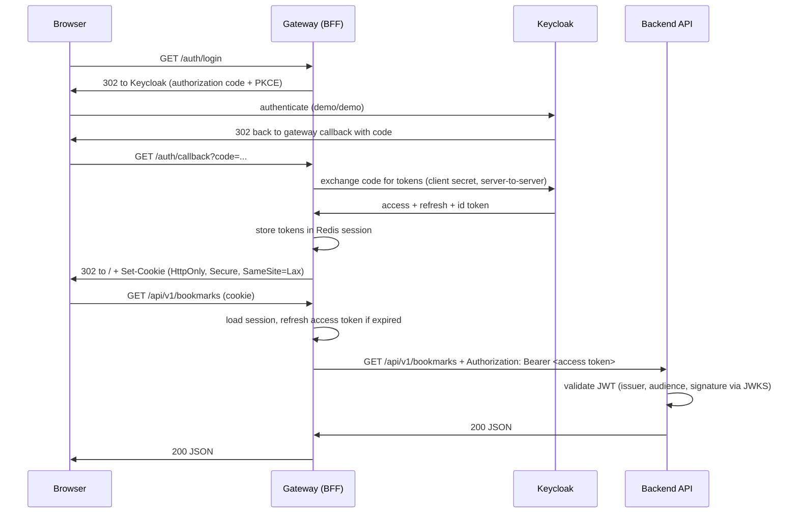

# Architecture

The architectural thesis of Stackverse: **applications are stateless; the session lives
at the edge, and tokens never reach the browser.** This is the BFF / token-handler
pattern, and every gateway implementation demonstrates it in its own stack.

## Components

| Component | Role | State |
|---|---|---|
| Frontend (SPA) | UI; calls `/api/*` with `credentials: include` | none — not even a token |
| Gateway (BFF) | OIDC client, session owner, reverse proxy, token relay | session data in Redis |
| Backend (API) | business logic, JWT validation, persistence | none — DB only |
| Keycloak | identity provider (OIDC) | users, clients |
| PostgreSQL | backend persistence | bookmarks |
| Redis | gateway session store | sessions (cookie id → tokens) |

The gateway *process* is stateless too: session data lives in Redis, so gateways scale
horizontally the same way backends do. The session cookie is the only state the browser
holds.

## Login flow

## The gateway contract

Every gateway implementation exposes the same surface on port **8000**:

| Route | Behavior |
|---|---|
| `GET /auth/login` | start OIDC authorization code flow (with PKCE) |
| `GET /auth/callback` | code exchange, create session, redirect to `/` |
| `POST /auth/logout` | destroy session, RP-initiated logout at the IdP, `204` |
| `GET /auth/session` | `200 {"authenticated":true,"username":...}` or `200 {"authenticated":false}` — for the SPA |
| `/api/**` | proxy to backend with token relay; `401` problem document if no session |
| `/**` | serve / proxy the frontend SPA |

Rules:

- Cookie: `HttpOnly`, `SameSite=Lax`, `Secure` outside local dev, name `stackverse_session`.
- Token refresh is the gateway's job — transparent to both SPA and backend.
- CSRF: state-changing `/api/*` requests must be protected (SameSite is the baseline;
  a double-submit or custom-header check is the recommended hardening — each gateway
  documents its mechanism).
- The gateway adds nothing to the API semantics: no rewriting of bodies, no auth
  decisions beyond "is there a valid session".
- The gateway is version-agnostic: `/api/**` covers `/api/v1/**`, `/api/v2/**`,
  and anything after — API versioning is entirely the backend's concern.

## Why this instead of JWT-in-the-SPA?

The common demo-app pattern (RealWorld included) keeps a JWT in browser storage.
It is simpler to demo and worse in every other way: tokens are exposed to XSS,
logout is fiction, refresh is awkward, and token lifetime becomes a UX problem.
The BFF pattern costs one extra component — which is exactly the component this
repository is about — and removes the whole class of problems. See the OAuth
[Browser-Based Apps BCP](https://datatracker.ietf.org/doc/html/draft-ietf-oauth-browser-based-apps)
for the standards-track version of this argument.

## Ports (local dev)

| Service | Port |
|---|---|
| Gateway (public entry) | 8000 |
| Backend | 8080 (internal; exposed only for direct API poking) |
| Keycloak | 8180 |
| PostgreSQL | 5432 |
| Redis | 6379 |
