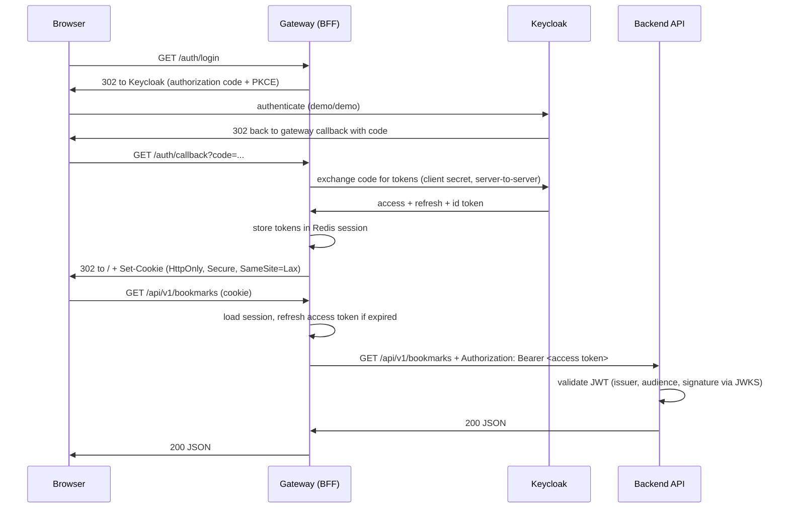

# Architecture

The architectural thesis of Stackverse: **applications are stateless; the session lives
at the edge, and tokens never reach the browser.** This is the BFF / token-handler
pattern, and every gateway implementation demonstrates it in its own stack.

## Components

| Component | Role | State |
|---|---|---|
| Frontend (SPA) | UI; makes same-origin `/api/*` calls that carry the session cookie | none — not even a token |
| Gateway (BFF) | OIDC client, session owner, reverse proxy, token relay | session data in Redis |
| Backend (API) | business logic, JWT validation, persistence | none — DB only |
| Keycloak | identity provider (OIDC) | users, clients |
| PostgreSQL | backend persistence | bookmarks |
| Redis | gateway session store | sessions (cookie id → tokens) |

The gateway *process* is stateless too: session data lives in Redis, so gateways scale
horizontally the same way backends do. The session cookie is the only state the browser
holds.

## Login flow

## The gateway contract

Every gateway implementation exposes the same surface on port **8000**:

| Route | Behavior |
|---|---|
| `GET /auth/login` | start OIDC authorization code flow (with PKCE) |
| `GET /auth/callback` | code exchange, create session, redirect to `/`. A failed callback (user cancelled at the IdP, stale or invalid state) creates no session and *also* redirects to `/` — the user is mid top-level navigation, so never a 5xx or an error page |
| `POST /auth/logout` | destroy session, RP-initiated logout at the IdP, `204` |
| `GET /auth/session` | `200 {"authenticated":true,"username":...}` or `200 {"authenticated":false}` — for the SPA |
| `/api/**` | proxy to backend — token relay when a session exists, anonymous relay without a token otherwise (the spec's public surface works logged-out); which endpoints require auth is the backend's decision |
| `/**` | serve / proxy the frontend SPA |

Rules:

- Cookie: `HttpOnly`, `SameSite=Lax`, `Secure` outside local dev, name `stackverse_session`.
- Token refresh is the gateway's job — transparent to both SPA and backend. Its two
  failure modes are distinct and must not be conflated: when the IdP **rejects** the
  refresh (an authoritative verdict on the grant — a `400`/`401` from the token
  endpoint, i.e. token expired or revoked), the session is dead — destroy it and
  degrade the request to anonymous. When the IdP is **unavailable** (unreachable,
  or answering with its own failure such as a `5xx` or `429`), nothing is known
  about the session — keep it (the refresh token may still be valid) and fail the
  request with a `503` problem document. A transient IdP outage must not log
  anyone out.
- CSRF: `SameSite=Lax` on the session cookie is the baseline; on top of it every
  gateway implements the same double-submit check. The gateway issues a readable
  `XSRF-TOKEN` cookie (not `HttpOnly`; `SameSite=Lax`, `Secure` outside local dev)
  to every browser, and state-changing `/api/**` requests (`POST`/`PUT`/`PATCH`/`DELETE`)
  must echo its value in an `X-XSRF-TOKEN` header. Missing or mismatched header →
  `403` with an `application/problem+json` body. All gateways implement exactly this
  mechanism — cookie name, header name, protected methods, and status code included.
- The gateway adds nothing to the API semantics: no rewriting of bodies, no auth
  decisions — it attaches a token when it has one and the backend authorizes per
  endpoint. A `401` the SPA sees on `/api/*` is the backend's problem document
  passed through untouched, never a gateway redirect. Browser cookies are
  gateway-only state and are stripped before proxying.
- The gateway is version-agnostic: `/api/**` covers `/api/v1/**`, `/api/v2/**`,
  and anything after — API versioning is entirely the backend's concern.

## Observability

Telemetry follows the same shape in every implementation: standard `OTEL_*`
environment variables, silent by default (`OTEL_SDK_DISABLED=true`), and an
all-in-one dev-grade collector behind the `observability` compose profile
(see [RUNNING.md](RUNNING.md); scope boundary in [INTENT.md](INTENT.md)).

- One browser action is **one trace**: when telemetry is enabled, the gateway
  propagates W3C `traceparent` on proxied `/api/**` requests, so the gateway
  span and the backend span join under a single trace id.
- Logs are part of the same pipeline — exported over OTLP next to traces and
  metrics, correlated by trace id. What and how to log is pinned in
  [LOGGING.md](LOGGING.md); it is a cross-implementation contract like the
  routes above.
- Service identity (`OTEL_SERVICE_NAME`) is per component
  (`stackverse-gateway`, `stackverse-backend`), set by compose.

## Why this instead of JWT-in-the-SPA?

The common demo-app pattern (RealWorld included) keeps a JWT in browser storage.
It is simpler to demo and worse in every other way: tokens are exposed to XSS,
logout is fiction, refresh is awkward, and token lifetime becomes a UX problem.
The BFF pattern costs one extra component — which is exactly the component this
repository is about — and removes the whole class of problems. See the OAuth
[Browser-Based Apps BCP](https://datatracker.ietf.org/doc/html/draft-ietf-oauth-browser-based-apps)
for the standards-track version of this argument.

## Ports (local dev)

| Service | Port |
|---|---|
| Gateway (public entry) | 8000 |
| Backend | 8080 (internal; exposed only for direct API poking) |
| Keycloak | 8180 |
| PostgreSQL | 5432 |
| Redis | 6379 |
| Frontend dev server (dev mode only; proxied by the gateway via `FRONTEND_URL`) | 5173 |
| Grafana (`observability` profile) | 3000 |
| OTLP collector (`observability` profile) | 4317 (gRPC) / 4318 (HTTP) |
